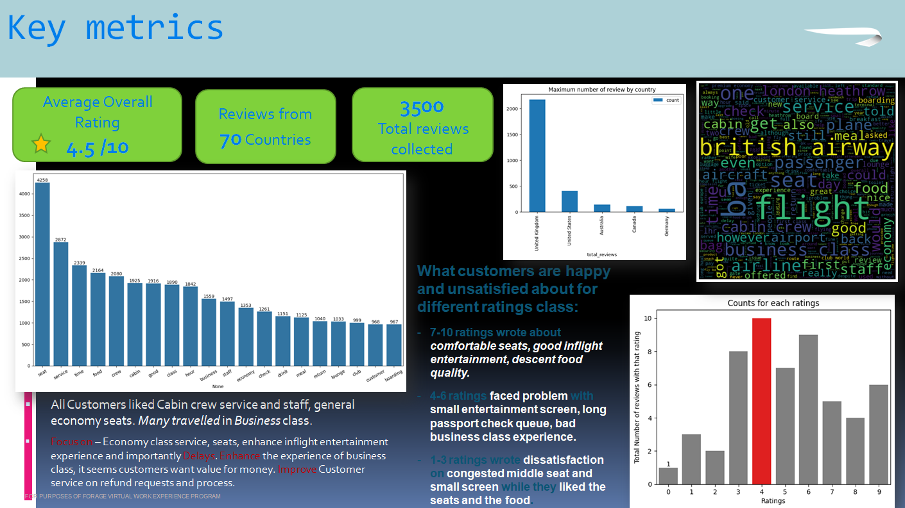
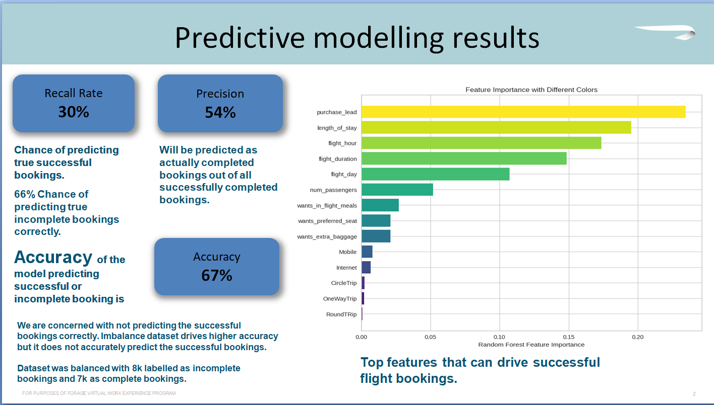

# British-Airways-Data-Science-Job-Simulation

## British Airways Data Science Job Simulation on Forage - July 2024

- **Completed a simulation focusing on how data science is a critical component of British Airways success.**
- **Scraped and analyzed customer review data to uncover findings.**
- **Built a predictive model to understand factors that influence buying behavior.**

---

### Scrape Data from the Web

The first step was to scrape review data from the web using the Skytrax website. The focus was specifically on reviews about the airline itself. Collecting extensive data was crucial for improving the output of the analysis. To start data collection, a Jupyter Notebook provided in the Resources section was utilized to run Python code for data scraping.

### Analyze Data

Once the dataset was obtained, it required extensive cleaning due to its purely textual nature. Data cleaning was performed to prepare the data for analysis. Initial analyses included topic modeling, sentiment analysis, and word clouds to gain insights into the review content. Python was recommended for this task, although any preferred tool could be used. Documentation websites in the Resources section provided guidance for data analysis.

### Present Insights

The findings were summarized within a single PowerPoint slide for presentation at the next board meeting. Visualizations and metrics were included to quickly convey key points from the analysis. A provided PowerPoint Template was used to complete this task.

### Explore and Prepare the Dataset

Time was spent exploring the dataset in the “Getting Started” Jupyter Notebook to understand different columns and basic statistics. Preparations for the predictive model included creating new features to enhance the model's performance. Resources provided additional guidance for this task.

### Train a Machine Learning Model

The dataset, once prepared, was used to train a machine learning model to predict customer bookings. A RandomForest algorithm was chosen for its ability to output information on variable contributions to predictive power.

### Evaluate Model and Present Findings

Model performance was evaluated using cross-validation and appropriate metrics. Visualizations were created to interpret variable contributions to the model. Findings were summarized in a single slide, as directed, using the provided PowerPoint Template.

